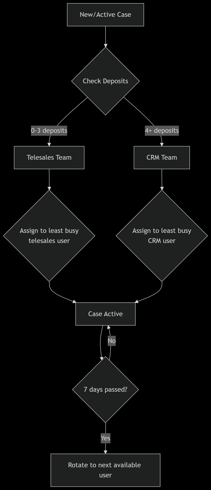

✨ Features
TypeScript - Full type safety and enhanced developer experience

Express.js - Fast, unopinionated web framework for Node.js

Docker Support - Containerized development and production environments

CI/CD Ready - Jenkins pipeline configuration included

Structured Architecture - Clean separation of concerns for maintainability

Input Validation - Comprehensive validation system

Database Migrations - Version-controlled database schema management

Environment Configuration - Secure management of environment variables

🏗️ Project Structure

# **    src/
    ├── configs/          # Application configuration files
    ├── constants/        # Constant values used across the application
    ├── controllers/      # Route handlers and business logic
    ├── lib/              # Utility libraries and third-party integrations
    ├── middlewares/      # Custom middleware functions
    ├── pkg/              # Package-specific code and modules
    ├── repository/       # Data access layer and database interactions
    ├── routes/           # API route definitions
    ├── services/         # Business logic services
    ├── types/            # TypeScript type definitions
    ├── utils/            # Helper and utility functions
    ├── validators/       # Input validation schemas and logic
    ├── app.ts           # Main application initialization
    └── server.ts        # Server configuration and startup**

🚀 Quick Start
Prerequisites
    -Node.js 18.x or higher
    -npm or yarn
    -Docker and Docker Compose (optional, for containerized deployment)
    -TypeScript 4.x or higher

Installation
1-lone the repository
    git clone <repository-url>
    cd <project-directory>
2-Install dependencies
    npm install
3-Set up environment variables
    cp .env.example .env
    # Edit .env with your configuration
4-Build the project
    npm run build

    Running the Application
5-Development mode with hot reload:
    npm run dev

6-Production mode:
    npm start

7-Using Docker:

    docker-compose up --build
📦 Available Scripts

    npm start - Start the application in production mode

    npm run dev - Start development server with hot reloading using nodemon

    npm run build - Compile TypeScript to JavaScript

    npm run test - Run test suite (if configured)

    npm run lint - Run linting tools (if configured)

🔧 Configuration
Environment Variables
```markdown
**    Create a .env file based on .env.example with your specific configuration:
    NODE_ENV=development
    PORT=3000
    DATABASE_URL=your_database_connection_string
    JWT_SECRET=your_jwt_secret_key
    API_PREFIX=/api/v1
    Database Migrations
    The project includes a migration system for database schema management:
    # Create a new migration
    npm run migrate:create -- <migration-name>

    # Run pending migrations
    npm run migrate:up

    # Rollback the latest migration
    npm run migrate:down**
```
🐳 Docker Deployment
    This project is Docker-ready with optimized multi-stage builds:
    # Build the image
    docker build -t express-ts-app .

    # Run the container
    docker run -p 3000:3000 --env-file .env express-ts-app
    Using Docker Compose for development:
    docker-compose up -d
📚 API Documentation
    Once the server is running, API documentation is available at:

    Swagger UI: http://localhost:3000/api-docs (if configured)

    Health check: http://localhost:3000/health

🧪 Testing
Run the test suite with:
    npm test
    For development with watch mode:
    npm run test:watch
🔍 Code Quality
    This project includes linting and formatting tools:
    # Lint code
    npm run lint

    # Format code
    npm run format

    # Check for type errors
    npm run type-check
🤝 Contributing
    We welcome contributions! Please follow these steps:

    Fork the repository

    Create a feature branch: git checkout -b feature/amazing-feature

    Commit your changes: git commit -m 'Add amazing feature'

    Push to the branch: git push origin feature/amazing-feature

    Open a pull request

    Commit Message Guidelines
    We follow conventional commit messages:

    feat: for new features

    fix: for bug fixes

    docs: for documentation changes

    style: for formatting changes

    refactor: for code refactoring

    test: for test-related changes

    chore: for maintenance tasks

🆘 Support
    If you encounter any problems or have questions:

    Check the existing Issues

    Create a new issue with a detailed description

    Contact the maintainers at [email protected]

🗺️ Roadmap
    Add authentication and authorization examples

    Include Redis integration for caching

    Add WebSocket support

    Implement rate limiting

    Add monitoring and logging examples



Happy coding! 🎉
